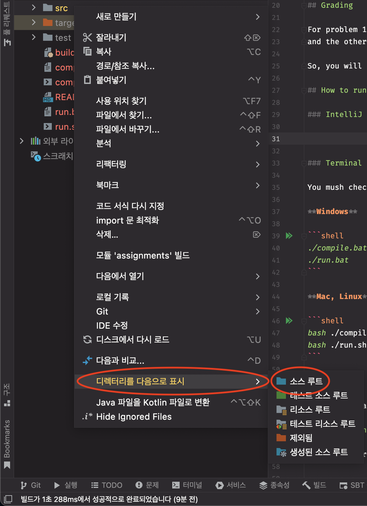

# Assignment 2: Programming Principles, SNU 4190.210

## Restrictions

**WARNING: Please read the restrictions below carefully.** 

If you do not follow it, **your submission will not be graded.**

1. Do not use the keyword `var`. Use `val` and `def` instead.
2. From now on, you can use some classes in scala.collections.* (except scala.collections.mutable.*) 
and basic APIs in String and Char classes. You can make your custom case classes.

Again, your score will be zero if you do not follow these rules.

Note that these rules will be gradually relaxed through the next assignments.

## Grading 

**Do not modify Data.scala**. 

We will grade your assignment only with the submitted Main.scala file.

## How to run

### IntelliJ IDEA

1. Open `hw2` directory from IntelliJ IDEA
2. Mark `src` folder as **Source root** like below

3. Mark `test` folder as **Test source root** by the same way.
4. Run `object Test extends App` from `test/hw2/Test.scala` to test your implementation.

### Terminal

You mush check that `scalac` and `scala` are runnable from your terminal.

**Windows**

```shell
./compile.bat
./run.bat
```

**Mac, Linux**

```shell
bash ./compile.sh
bash ./run.sh
```

## Q&A

If you have any questions, please submit an issue to [pp202202 issue tracker](https://github.com/snu-sf-class/pp202202/issues).

## Submissions

[http://pp.kinetc.net:10000](http://pp.kinetc.net:10000)

### How to submit

Compress `src` folder and submit compressed zip file.

**WARNING**: The structure of the submitted zip file must look like below. If it's not, the server will show you `COMPILE ERROR` or etc.

```
submit.zip
|- src
   |- hw2
      |- Main.scala
      |- Data.scala (optional, but it will not be compiled)
```


